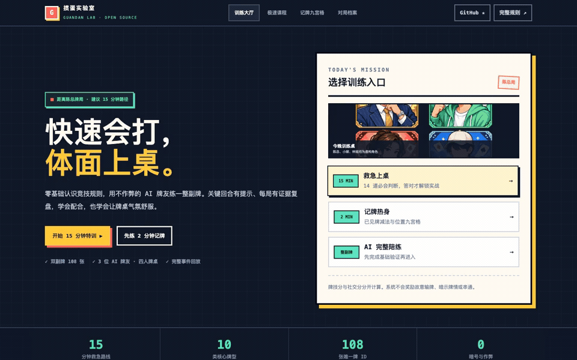
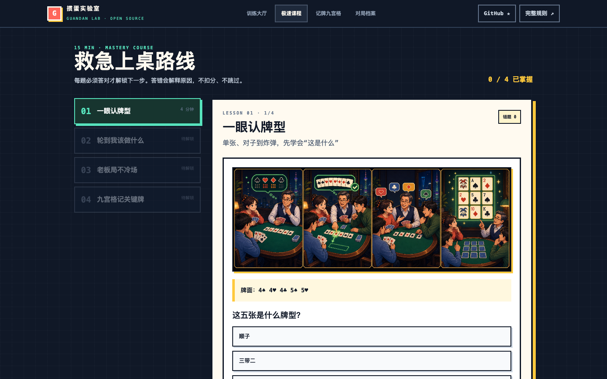
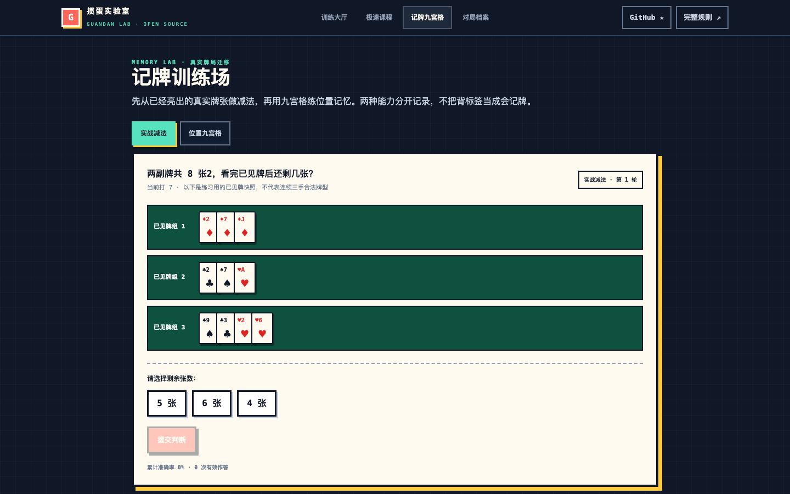
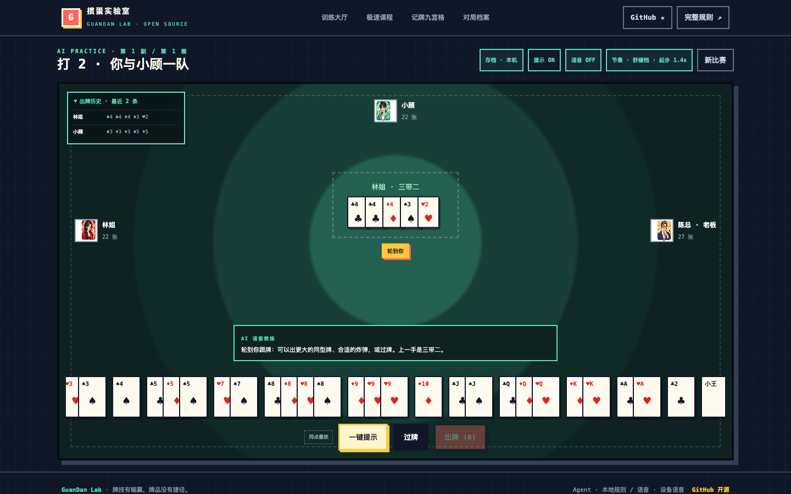

# GuanDan Lab · 掼蛋实验室

> 快速会打，体面上桌。不是教你赢老板，是教你成为大家愿意再约的搭档。

[English README](./README_EN.md)

[](https://github.com/Mereithhh/guandan-lab/actions/workflows/ci.yml)
[](https://github.com/Mereithhh/guandan-lab/releases)
[](./LICENSE)
[](https://guandan-bootcamp.miromind-0889.chatgpt.site)

[▶ 在线体验](https://guandan-bootcamp.miromind-0889.chatgpt.site) · [☆ Star 项目](https://github.com/Mereithhh/guandan-lab) · [⌘ 本机运行](#快速启动)

[在线体验](https://guandan-bootcamp.miromind-0889.chatgpt.site) · [部署指南](./docs/DEPLOYMENT.md) · [路线图](./ROADMAP.md) · [Launch Kit](./docs/LAUNCH_KIT.md) · [素材授权](./docs/ASSETS.md) · [隐私说明](./PRIVACY.md) · [参与贡献](./CONTRIBUTING.md)

GuanDan Lab 是一个开源的零基础掼蛋训练器。它先用标称 15 分钟的 mastery 课程教授核心规则，再让用户进入不会偷看牌的 AI 整副陪练、记牌训练和逐手复盘。默认场景是陪虚构角色“陈总”上桌：目标是节奏舒服、配合清楚、牌品可靠，而不是故意输牌或暗示牌情。



[确定性核心与 32 项一致性检查](./tests/unit/conformance.test.ts) · [公平 AI 的可见信息边界](./docs/ARCHITECTURE.md) · 174 项单元/契约测试 · [beta.15 付费服务安全审查](./docs/SECURITY_REVIEW_BETA15.md)

## 已经可以做什么

- 以 2022 年《竞技掼蛋竞赛规则（试行）》为基线实现教学规则；地区差异会明确标为变体，来源与已知差异见 [RULES_SOURCES.md](./RULES_SOURCES.md)。
- 使用两副 108 张唯一牌 ID 完成四人对局，规则引擎负责校验所有动作。
- 三位本地 Agent 有可测试的固定风格：陈总稳健控场、小顾搭档优先、林姐效率突围；配置兼容 OpenAI 的服务端接口后，大模型会收到相同角色标识，返回动作仍会经过本地合法性校验。
- 配置 ElevenLabs 后使用中文语音教练；未配置或请求失败时回退到设备语音，字幕始终存在。
- 首页、15 分钟 mastery 课程与完整规则支持中英双语；键盘可操作的语言选择会保存在本机，牌局规则逻辑不复制。
- 课程后提供 5 个可选的确定性“陈总局”迷你残局：每关只有 5—7 张手牌，所有候选动作经真实规则引擎校验，并分别解释牌技与牌桌表达。
- 同点手牌叠放、可调 AI 节奏、最近出牌记录、一键合法提示。
- 可安装的 Web App、搜索引擎发现文件、真实能力结构化数据和不含追踪参数的系统分享入口。
- 基于真实双副牌 ID 的已见牌减法、位置九宫格、完整事件回放，以及牌技分与社交分分离的赛后建议。
- 游客模式无需注册；浏览器支持且未清理 localStorage 时会保存训练记录，自托管配置 SQLite 后可跨设备合并课程、残局、两种记牌成绩、偏好、完整牌局事件与分析，旧设备不会把已获得进度锁回去。

<details>
<summary>查看真实界面截图</summary>





</details>

## 快速启动

需要 Node.js 22.13+：

```bash
git clone https://github.com/Mereithhh/guandan-lab.git
cd guandan-lab
cp .env.example .env.local
npm ci
npm run dev
```

打开 `http://localhost:3000`。所有第三方 AI/TTS 配置都是可选项，没有密钥也能完成完整本地训练。

Docker：

```bash
cp .env.example .env.local
# 在 .env.local 中设置至少 24 位随机 SESSION_SECRET
docker compose up --build
```

默认 SQLite 数据位于 Docker 命名卷的 `/data/guandan.sqlite`。数据库启用 WAL、外键与 busy timeout，并保存游客资料、会话、训练档案、完整牌局、逐手事件、分析和用量配额表。未配置 `SESSION_SECRET` 时会安全降级为纯本机存档，不会签发可伪造的生产会话。

准备公开部署前运行 `docker compose run --rm --no-deps web node scripts/doctor.mjs`；本地 Node 开发也可运行 `npm run doctor`。它会检查会话、SQLite、HTTPS、OAuth、在线匹配、兼容模型、ElevenLabs 和打赏链接，只输出能力状态与修复建议，不会显示任何密钥；存在生产阻断项时以非零状态退出。

公网服务器、TLS 反向代理、备份、升级与 `guandan.mereith.com` DNS 步骤见 [部署指南](./docs/DEPLOYMENT.md)。

自托管数据接口支持 `GET /api/progress?export=1` 导出当前游客的数据，及 `DELETE /api/progress` 删除资料。训练档案采用有界单调合并和版本比较：版本冲突时客户端只把上次确认后新增的答题记录重放到最新云档案，课程与残局不会被较旧快照降级，满 50 条且无法判断先后的分叉快照会保留服务器历史。写入和删除要求同源请求与 HttpOnly 签名会话；保存事务会再次验证会话，确认删除时也会清除本设备训练记录，避免旧请求或本地资料恢复已删除账户。

可选 Google OAuth 使用 Authorization Code + PKCE。把 `${SITE_URL}/api/auth/google/callback` 注册为回调地址，再配置 `GOOGLE_CLIENT_ID` 与 `GOOGLE_CLIENT_SECRET`；登录后会在事务中把当前游客的训练档案与牌局历史认领到 Google 资料。项目只保存 Google subject、邮箱和显示名，不保存 Google access token。

设置 `ONLINE_MATCHING_ENABLED=1` 可启用自托管四人真人匹配预览。服务端生成牌局、按乐观版本执行每个动作，并向玩家只投影自己的手牌和公开信息；浏览器每秒短轮询，因此刷新后能重新进入进行中的房间。该预览没有聊天，公网开放前仍应在反向代理层配置 TLS、连接级限流和监控。

## 可插拔 AI 与语音

所有密钥只由服务端读取，绝不能使用 `NEXT_PUBLIC_*`：

```dotenv
AI_BASE_URL=https://your-provider.example/v1
AI_API_KEY=replace-me
AI_MODEL=your-model
PAID_PROVIDERS_ENABLED=1
PAID_PROVIDER_USER_DAILY_UNITS=250
PAID_PROVIDER_GLOBAL_DAILY_UNITS=5000

ELEVENLABS_API_KEY=replace-me
ELEVENLABS_VOICE_ID=replace-me
ELEVENLABS_MODEL_ID=eleven_multilingual_v2

# Optional: show a voluntary support QR code in the footer.
SUPPORT_URL=https://your-public-payment-link.example
```

`AI_BASE_URL` 默认必须是公网 HTTPS 地址，并固定请求 `/chat/completions`。只有在明确知道风险的本地自托管环境中，才能设置 `AI_ALLOW_PRIVATE_BASE_URL=1` 访问局域网模型。

赛后大模型只会收到公开出牌事件、名次和不含暗牌的本地确定性统计，不会收到任何玩家未出的手牌。模型只能从受控的牌风与建议代码中选择，由本地映射为审核过的文案；牌技分、社交分和统计证据也始终由本地代码确定。超时、限流、自由文本或格式错误都会明确回退到本地证据复盘。

页面底部会显示当前能力模式：`本地规则 / 设备语音`，或在完整安全配置后显示 `兼容大模型优先 / ElevenLabs 优先`。这里的“优先”表示远程服务异常时仍会自动回退，所有大模型动作依然必须经过本地规则校验。可用下面的无密钥自检确认服务端实际识别到的模式：

```bash
curl -s http://localhost:3000/api/session
# 查看 agentProvider 与 voiceProvider；响应不会包含 Base URL、模型名或密钥。
```

开启付费服务时，`SESSION_SECRET`、`DATABASE_PATH`、单用户日预算和全站日预算均为必填项，否则服务会拒绝调用 Provider。预算按 UTC 日在 SQLite 中原子扣减；Agent 默认 1 单位、赛后复盘 2 单位、ElevenLabs 每 100 字 1 单位，均可用 `.env.example` 中的变量调整。这些是相对成本单位，不代表实际货币或 Token 数，请按 Provider 价格设置保守上限。

兼容模型与语音各自带有失败熔断、半开单探针和进程内并发上限；ElevenLabs 相同文本会在鉴权后使用哈希缓存和单航班请求。SQLite 日预算是单机持久化的，但熔断器和并发计数属于单个 Node 进程；公开部署仍应在反向代理增加连接级限流，并在 Provider 控制台设置硬预算与告警。

## 验证

```bash
npm run typecheck
npm run lint
npm test
npm run test:coverage
npm run build
npm run test:e2e
```

规则域目前包含牌张守恒、非法动作、牌型、压牌、贡还牌、AI 不作弊观察和牌风分析测试；另有 32 项 2022 竞赛规则一致性检查（30 个表驱动夹具、1 个响应权场景、1 个来源校验）。Agent 与 ElevenLabs 路由契约覆盖认证头、超时、畸形上游、重定向、音频类型和密钥不泄露。规则争议请使用专门的 Issue 模板，并附最小牌例、规则版本和出处。

## 架构边界

`lib/game` 是零 I/O 的确定性规则核心。公开 Demo 默认以单机训练为主；自托管设置 `ONLINE_MATCHING_ENABLED=1` 后可启用四人真人匹配 Beta。在线房间采用服务端权威状态、仅本人手牌的座位投影、版本化动作日志、刷新重连、两分钟无操作取消和主动退出；详见 [架构说明](./docs/ARCHITECTURE.md)。

自托管长期路线是 Node BFF + SQLite 单实例；Cloudflare Sites 路线使用 D1 + Durable Objects。两者共享规则核心和网络协议，不共享存储实现。

## 项目路线

- `0.2`：开源基础、陈总训练场景、兼容 AI Provider、ElevenLabs TTS、Docker。
- `0.3 beta`：游客云存档、SQLite、Google OAuth 数据认领、服务端权威四人匹配与轮询重连进入自托管预览。
- `0.4`：阶段牌风反馈与掉线 AI 托管。
- `0.5`：举报、观战、稳定房间协议与多实例协调。
- `1.0`：规则变体插件、Agent 锦标赛、稳定协议与可复用规则 SDK。

路线图不是已上线能力。完整状态和验收标准见 [ROADMAP.md](./ROADMAP.md)。

## 传播与伦理

- 不奖励喂牌、串通、偷看隐藏信息或故意输牌。
- “陈总”是虚构训练角色，不影射任何真实个人。
- 牌技有输赢，牌品没有捷径。

## 许可证

代码使用 [Apache License 2.0](./LICENSE)。AI 生成的原创品牌图片会在提交记录中标明；扑克花色字符属于通用符号。项目名称与视觉标识暂不作为兼容实现的背书。

欢迎提交规则牌例、地区变体资料、Agent 策略、无障碍改进和新手课程设计。可以从 [good first issue](https://github.com/Mereithhh/guandan-lab/issues?q=is%3Aissue+is%3Aopen+label%3A%22good+first+issue%22) 开始，并先阅读 [贡献指南](./CONTRIBUTING.md) 与 [安全策略](./SECURITY.md)。
